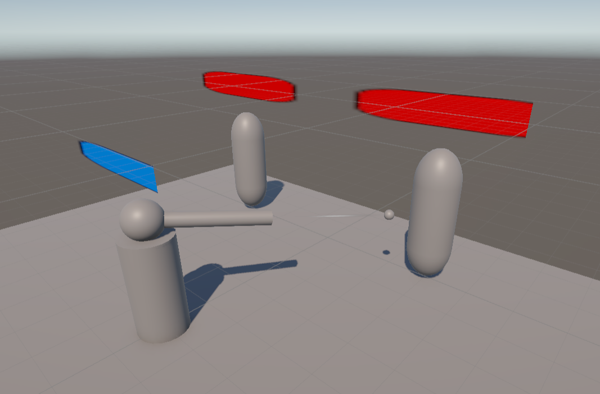
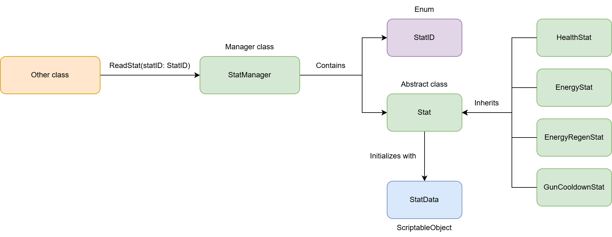
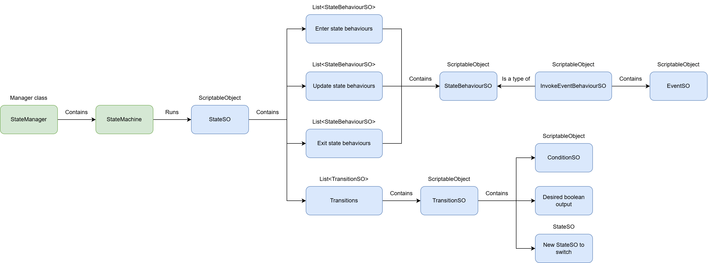
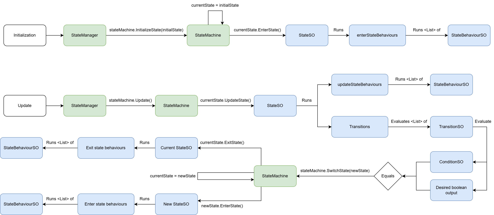

# Tower Defense Template

  An exercise where the modularity, reusabulity and scalability of game systems were explored.
    
  

## Overview
The Tower Defense Template is solely developed during the Industrial Training course. This project serves as a foundation for experimenting with scalable game systems that can be reused across different genres rather than developing a polished tower defense game.

In the prototype, the turret detects any targets within a radius, rotates the head and attack the target 

During development, this project became a valuable learning platform for understanding software architecture, system decoupling and code reusability. Many of the concepts and design patterns explored in this project were later refined and expanded in <a href="https://github.com/YongKang03/versus-multiplayer-shooter">Versus Multiplayer Shooter</a> project, where they were adapted to support more complex gameplay mechanics and multiplayer networking.

## Objective
- **Apply object-oriented programming concepts in game development**
  - Use abstract classes to create a flexible stat system structure.
  - Apply interfaces to decouple gameplay interactions such as targeting and damage handling.
  - Utilize events and delegates to improve communication between independent systems, including weapon switching, UI updates and state behaviour interactions.
- **Develop reusable gameplay systems through modular architecture**
  - Design a generic stat management system that allows different gameplay attributes to be extended and managed consistently.
  - Build a state machine framework with reusable states and state behaviours to support flexible entity behaviours.
  - Improve separation of responsibilities by ensuring individual systems handle their own specific logic without unnecessary dependencies.
- **Explore Unity ScriptableObject-based architecture**
  - Utilize ScriptableObjects to create data-driven and configurable gameplay components.
  - Implement ScriptableObject-based states, behaviours and data structures to improve scalability and reduce hardcoded logic.
- **Understand software architecture principles for larger-scale projects**
  - Practice designing maintainable systems through abstraction, decoupling and modularity.

## Feature
### Stat
Create a reusable framework for managing gameplay attributes such as health, energy and cooldowns.

Developed a `StatManager` that stores different stat objects through a common interface. Individual stats (`HealthStat`, `EnergyStat`, `GunCooldownStat`) inherit from an abstract `Stat` class and own an unique `StatID` enum. Configuration values are stored separately using `StatData` ScriptableObject. EEach of stats can be paired with a `StatID` and `StatData`, and `StatManager` exposes these stats to other classes with encapsulation.

- Supports adding new stat types without modifying existing systems.
- Separates runtime values from configurable data.
- Allows UI and gameplay systems to access stats through a unified interface.

   
  
   
  The architecture of the <code>Stat</code>.
    

### State machine
Provide a reusable framework for controlling gameplay behaviours without hardcoding state transitions for individual game objects.

Implemented a `StateMachine` architecture that supports and scales with states. Individual states are created as `StateSO` ScriptableObject containing configurable enter, update and exit behaviours. Every enter, update and exit behaviours are defined as `StateBehaviourSO` ScriptableObject where they run a specific behaviour from a defined state manager. State transitions are evaluated through reusable `TransitionSO` objects during the update behaviours, which contains a `ConditionSO` that runs a boolean method, the desired boolean output and the new `StateSO` to switch to. `EventSO` ScriptableObject is used to represent an event that can be invoked later for others in the `StateSO` behaviours using `InvokeEventSO` (`EventSO` and `InvokeEventSO` are SO-driven concept, they can be expanded to handle different type of events such as void or interface-based events). Each behaviour can be configured directly in the Unity Inspector after the required methods are defined, allowing state logic to be adjusted without modifying source code.

- Generic implementation reusable across different entity types.
- ScriptableObject-driven workflow reduces duplicated code.
- Behaviours and transitions can be composed through the Unity Inspector.
- Encourages separation between state logic and gameplay objects.

   
  
   
  The architecture of the <code>StateMachine</code>.
    
  
  
   
  The runtime flow of the <code>StateMachine</code>.
    

## Technology
- **Unity** – Core game engine used for developing the game archtiecture and systems.
- **C#** – Primary programming language for gameplay mechanics and systems.
- **Microsoft Visual Studio** – IDE used for scripting and debugging.

## Future Refinement
Although this project successfully established the foundation of reusable gameplay architecture, several areas could be further improved to increase flexibility and scalability.

### Data-driven stat and state registration
The current implementation requires each `Stat` and `State` to be manually configured in the Unity Inspector. A future improvement would be introducing a more flexible registration system where new stats and states can be added through **configurable lists or collections** without requiring additional code changes in the managers. This would allow designers to extend gameplay systems more efficiently and improve the scalability of the framework.

### More generic entity support for state machine
The current `StateMachine` architecture was designed around the turret entity. This should be further **decoupled from the specific entity** to allow it to be reused across different types of objects such players, enemies or interactive objects. This would make the framework more suitable as a general-purpose gameplay architecture.

### More flexible transition conditions
The current state transition system, `TransitionSO` supports a single condition checking, but it could be expanded to support more complex transition logic. Potential improvements could include **supporting multiple conditions** within a single transition, and **allowing logical operations** such as AND / OR for transition evaluation. This would allow the state to handle more advanced behaviours without creating additional custom logic.

### Advanced parameterized state behaviours
Although `StateBehaviourSO` could support configurable parameters to the behaviours through configurable ScriptableObjects, a further refinement could be applied to **move behaviour-specific parameters from the behaviour asset into the state configuration level**. This would allow the same behaviour implementation to be reused with different parameter values across multiple states without requiring duplicate ScriptableObject assets.

 

The limitations discovered during this project provided valuable design insights, and some of them had been addressed in <a href="https://github.com/YongKang03/versus-multiplayer-shooter">Versus Multiplayer Shooter</a> project, where the systems was further refined with improved generic support, reusable state handling and better integration with more complex gameplay systems.

## Media

  
   
  The gameplay demo of the Tower Defense Template.
    

  
   
  idk what to write yet

